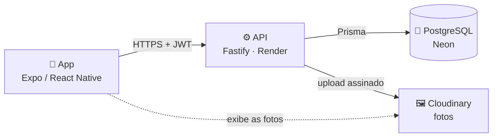

<div align="center">


### Cidade conectada. Problema identificado.

Aplicativo para cidadãos denunciarem **postes e fios danificados** com foto e localização,<br/>
e para a prefeitura acompanhar cada ocorrência até a solução.

<br/>

[](https://docs.expo.dev/versions/v57.0.0/)
[](https://reactnative.dev)
[](https://www.typescriptlang.org)
[](#-gerar-o-apk)

[](https://docs.expo.dev/router/introduction/)
[](https://biomejs.dev)
[](https://www.conventionalcommits.org/pt-br/)
[](LICENSE)
[](https://univesp.br)

</div>

---

## 📍 Sobre

Fio rompido na calçada, poste sem luz, cabo de internet caído depois da chuva: o **Smart Poste** permite que o morador registre o problema em segundos, tirando uma foto. O app anexa **onde** e **quando** aconteceu, gera um **protocolo** (ex.: `SP-0001`) e envia para a prefeitura. Todo mundo do município acompanha as ocorrências num feed, e o status muda de **Recebida** para **Em análise** e depois para **Resolvida**.

O projeto começou em **Piracaia (SP)** e foi pensado para vários municípios conveniados: cada conta pertence a um município, e o feed mostra só as ocorrências dele.

> As contas são criadas pela prefeitura. Não há cadastro aberto: assim, cada denúncia vem de um morador identificado, sem expor quem denunciou.

## ✨ Funcionalidades

- 📸 **Denúncia com foto**: câmera dentro do app, sem som de disparo e com a foto reduzida antes do envio
- 🛰️ **Localização automática**: GPS de alta precisão e endereço por extenso (rua e bairro)
- 🧾 **Protocolo na hora**: número sequencial por município, sem repetição
- 📰 **Feed do município**: ocorrências mais recentes primeiro, com a **distância até você**, carregando mais ao rolar e atualizando ao puxar a lista
- 🙋 **Minhas denúncias** e **perfil** com o total de denúncias feitas
- 🔐 **Login com CPF**: a sessão fica no cofre criptografado do aparelho e cai sozinha se a senha for trocada em outro lugar
- 🚦 **Status em tempo real**: `Recebida → Em análise → Resolvida`, atualizado pela prefeitura

## 📱 Telas

| # | Tela | Arquivo | O que faz |
|:-:|---|---|---|
| 01 | Abertura | `src/app/index.tsx` | Splash com a marca |
| 02 | Município | `src/app/municipio.tsx` | Escolha do município conveniado (lista vinda da API) |
| 03 | Login | `src/app/login.tsx` | CPF e senha fornecidos pela prefeitura |
| 04 | Feed | `src/app/(tabs)/feed.tsx` | Ocorrências do município, com distância |
| 05 | Câmera | `src/app/denuncia/nova.tsx` | Foto do problema e estado da localização |
| 06 | Detalhes | `src/app/denuncia/detalhes.tsx` | Endereço, tipos de problema e observação |
| 07 | Perfil | `src/app/(tabs)/perfil.tsx` | Dados da conta e total de denúncias |
| 08 | Sucesso | `src/app/denuncia/sucesso.tsx` | Protocolo gerado |
| — | Minhas denúncias | `src/app/minhas-denuncias.tsx` | Só as denúncias do usuário |

## 🏗️ Como funciona



- O app fala **só** com a API, sempre em HTTPS. O contrato completo (rotas, formatos e erros) está em [`docs/API.md`](docs/API.md).
- A API guarda os dados no PostgreSQL e envia as fotos ao Cloudinary, que devolve um link público.
- Backend: [**SmartPoste-backend**](https://github.com/felipengr/SmartPoste-backend).

## 🛡️ Privacidade e segurança

| Cuidado | Como |
|---|---|
| Sessão protegida | O token fica no **`expo-secure-store`** (Keystore do Android / Keychain do iOS), nunca em armazenamento comum |
| Sessões antigas caem | Trocar a senha invalida os tokens de todos os aparelhos; um 401 em qualquer tela volta para o login |
| Quem denunciou não aparece | A API nunca devolve nome nem CPF do autor; o app só sabe se a denúncia é **sua** |
| Foto sem rastros | A API apaga os metadados (EXIF) da foto, inclusive o **GPS do celular**, antes de publicá-la |
| Endereço sem número | O feed mostra só **rua e bairro**: o número poderia ser a casa de quem denunciou |
| Local exato para a prefeitura | As coordenadas exatas seguem para a API: é com elas que a equipe acha o poste |
| Força bruta | A API limita as tentativas de login por CPF e por IP |

## 🧰 Stack

| Camada | Tecnologia |
|---|---|
| App | [Expo SDK 57](https://docs.expo.dev) · React Native 0.86 · React 19 · TypeScript |
| Navegação | [Expo Router](https://docs.expo.dev/router/introduction/) (rotas por arquivo, telas protegidas por sessão) |
| Câmera e foto | `expo-camera` · `expo-image-manipulator` · `expo-file-system` |
| Localização | `expo-location` (GPS e endereço por extenso) |
| Sessão | `expo-secure-store` |
| Qualidade | Biome · TypeScript estrito · commitlint + husky |
| Build | [EAS Build](https://docs.expo.dev/build/introduction/) |

## 🚀 Rodando localmente

**Pré-requisitos:** Node 24 e o app **Expo Go** no celular, ou um emulador Android (Android Studio).

```bash
npm install
npx expo start      # depois: "a" abre no emulador, ou escaneie o QR code com o Expo Go
```

O endereço da API fica no **`.env.local`**, fora do git. Crie o arquivo com **uma** das opções:

```bash
# API rodando no seu computador, app no emulador Android
EXPO_PUBLIC_API_URL=http://10.0.2.2:3333/v1

# API no seu computador, app no celular (mesmo Wi-Fi): use o IP do computador
EXPO_PUBLIC_API_URL=http://192.168.0.10:3333/v1

# API de produção
EXPO_PUBLIC_API_URL=https://smartposte-api.onrender.com/v1
```

> A API de produção roda no plano grátis do Render e "dorme" depois de 15 minutos sem uso: a primeira chamada pode levar uns 50 segundos.

Para subir a API localmente, veja o [README do backend](https://github.com/felipengr/SmartPoste-backend#readme).

## 📦 Gerar o APK

O APK é gerado na nuvem pelo **EAS Build**. Não precisa de Android Studio, e o plano grátis atende.

```bash
npx eas-cli@latest login
npx eas-cli@latest build -p android --profile preview
```

O perfil `preview` (em [`eas.json`](eas.json)) gera um **APK de distribuição interna** já apontando para a API de produção. No fim, o EAS mostra um link e um QR code para baixar e instalar.

> No Android, permita **"Instalar apps desconhecidos"** para o navegador ao abrir o APK.

## 🗂️ Estrutura

```
src/
├── app/            telas (cada arquivo é uma rota do Expo Router)
│   ├── (tabs)/     feed e perfil, com a barra de abas
│   └── denuncia/   câmera, detalhes e sucesso
├── api/            cliente HTTP, sessão no cofre e uma função por rota do contrato
├── components/     cards, botões, cabeçalhos, lista paginada
├── context/        sessão e rascunho da denúncia
├── hooks/          useDenuncias (paginação, atualização, recarga)
├── utils/          localização, preparo da foto, formatação
├── theme/          cores, espaçamentos e raios
├── rotulos.ts      textos exibidos para os códigos da API
└── types.ts        tipos do contrato
docs/API.md         contrato da API (fonte de verdade entre app e backend)
```

## 🧪 Scripts

| Comando | O que faz |
|---|---|
| `npx expo start` | Servidor de desenvolvimento |
| `npm run check` | Lint + formatação (Biome) |
| `npm run typecheck` | Checagem de tipos |
| `npm run release` | Sobe a versão (`package.json` e `app.json`) e atualiza o `CHANGELOG.md` |

## 🤝 Convenções

- **Commits** no padrão [Conventional Commits](https://www.conventionalcommits.org/pt-br/), em português, validados pelo commitlint
- **Uma branch por tarefa**, a partir da `main`, com Pull Request
- **Contrato primeiro**: mudou algo na API? Atualize o [`docs/API.md`](docs/API.md) no mesmo PR

---

<div align="center">

Feito para o **Projeto Integrador da UNIVESP** por **Felipe Nogueira** · Licença [MIT](LICENSE)

</div>
